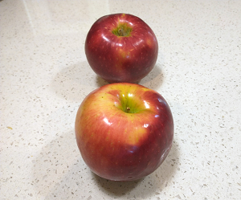
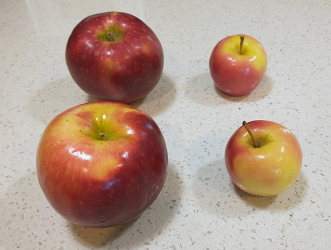
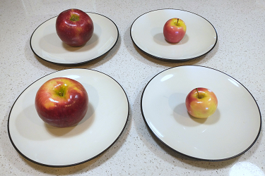

# All data is a simplification of reality

Data often give the appearance of being something concrete and reliable, especially if it is numerical data, but there are many potential pitfalls in dealing with any data set, such as:
- missing data
- erroneous data (e.g., mislabeled, typos)
- biased data
- manipulated data

But even in the best of situations, data are still a simplification of reality. Let me explain by giving a concrete example involving apples:

## Counting Apples
We all know simple math facts, like 2 + 2 = 4, and that we can evenly split 4 into 4 1's. So that means that if we had two apples like this:

And we added two more apples, we would have 4 apples (because 2 + 2 = 4), like this:

And if there were four of us who wanted to have apples, we could give each person 1 apple, and they would have the same number of apples, like this:

Now, while each person has 1 apple, you might complain that it isn't fair, since the apples weren't all the same size. Two of the four apples were particularly small.

So, there was a simplification here. In this example, I decided that each of these would count as "1 apple." This way of looking at things might not work well in some situations:
- If we want everyone to get the same amount of apples by weight, we would have to cut the apples into pieces so we could give each person the same amount.
- If we wanted to give everyone some amount of apple that they could keep for a few days before eating, then we would want to not cut the apples, so keeping them as whole apples might be the best solution.

## What we lose in simplifying

As you can see in the apple example, any time we turn something into data, we are making a simplification.* If we are counting the number of something, like apples, we are deciding that each one is equivalent. If we are writing down what someone said, we are losing their tone of voice, accent, etc. If we are taking a photograph, it is only from one perspective, etc.
- Different simplifications are useful for different tasks, and unhelpful for others.
  - See: [All models are wrong, but some are useful](https://en.wikipedia.org/wiki/All_models_are_wrong)
- *Note: You can have data that isn't a simplification, if the data source is symbolic and you are applying unambiguous rules. For example, data that can be made without simplification include:
  - A list of the first 10 prime numbers.
  - The number of times the letter 'a' (capital or lower case) appears in this sentence.

## More examples of simplifications
So all data that you might find is a simplification. There are many seemingly simple questions that in some situations or for some people, there are no simple answers, questions like:
- What country are you from?
  - _What if you were born in one country, but moved to another shortly after? What if you are from an area claimed by multiple countries?_
- How many people live in this house?
  - _Does a college student returning home for the summer count as living in that house?_
- How many words are in this chapter?
  - _[Different programs use different rules for what counts as a "word"](https://thehappybeavers.com/blog/why-word-count-differ-programs/)_
    - E.g., this page has "2 + 2 = 4", which Microsoft Word counts as 5 words, and Google Docs counts as 3 words.

Note: This section was inspired by Kareem Carr https://twitter.com/kareem_carr/status/1551950155330600960, https://www.popularmechanics.com/science/math/a33547137/why-some-people-think-2-plus-2-equals-5/
