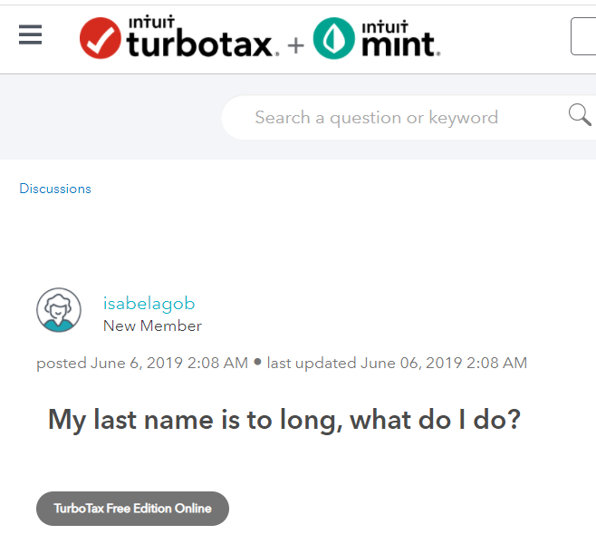
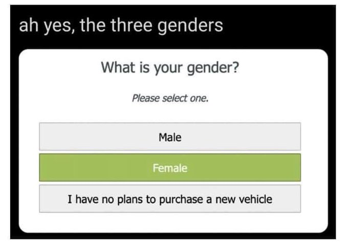

# Who does data fit?
Because all data is a simplification of reality, those simplifications work well for some people and some situations, but can cause problems for other people and other situations.

Thus, when designers of social media systems make decisions about how data will be saved and what constraints will be put on the data, they are making decisions about who will get a better experience. Based on these decisions, some people will fit naturally into the data system, while others will have to put in extra work to make themselves fit, and others will have to modify themselves or misrepresent themselves to fit into the system.

So, for example, if we made a form that someone needed to enter their address, we could assume everyone is in the United States and not have any country selection.
- Address fields:
  - Street address
  - City
  - State
  - Zip Code

Someone in another country would have to try to find a way to indicate that they aren't in the United States even though there is no clear place to indicate that. If this is a form for shipping to people in the US only, then this limitation might make sense.

If we wanted people to be able to enter other countries we could make a country drop down tool to select a country, but then would we auto-fill it with a country? If there is a list of countries to scroll through, what order do we put them in? If it's alphbetical, that will make it easier for people in countries whose name starts with "A."

## Form fails
Let's look at some examples where forms show problems with data entry and representation:

### Name Length
Here are some screenshots from a [help forum discussion](https://ttlc.intuit.com/community/taxes/discussion/my-last-name-is-to-long-what-do-i-do/00/655670) on the United States tax software TurboTax:

As you can see, TurboTax has a limit on how long last names are allowed to be, and people with too long of names have different strategies with how to deal with not fitting in the system.

### Gender/Sexuality
Data collection and storage can go wrong in other ways as well, with incorrect or erroneous options. Here are some screenshots from a thread of people collecting strange gender selection forms (the images link to the tweets I got them from if you want to see more in the twitter thread):

- 

- 

- 

Think for a minute about consequentialism. On this view, we should do whatever results in the best outcomes for the most people. One of the classic forms of this approach is utilitarianism, which says we should do whatever maximizes 'utility' for most people. Confusingly, 'utility' in this case does not refer to usefulness, but to a sort of combo of happiness and wellbeing. When a utilitarian tries to decide how to act, they take stock of all the probably outcomes, and what sort of 'utility' or happiness will be brought about for all parties involved. This process is sometimes referred to by philosophers as 'utility calculus'. When I am trying to calculate the expected net utility gain from a projected set of actions, I am engaging in 'utility calculus' (or, in normal words, utility calculations).

Now, there are many reasons one might be suspicious about utilitarianism as a cheat code for acting morally, but let's assume for a moment that utilitarianism is the best way to go. When you undertake your utility calculus, you are, in essence, gathering and responding to data about the projected outcomes of a situation. This means that _how_ you gather your data will affect _what_ data you come up with. If you have really comprehensive data about potential outcomes, then your utility calculus will be more complicated, but will also be more realistic. On the other hand, if you have only partial data, the results of your utility calculus may become skewed. If you think about the potential impact of a set of actions on all the people you know and like, but fail to consider the impact on people you do not happen to know, then you might think those actions would lead to a huge gain in utility, or happiness.

When we think about how data is used online, the idea of a utility calculus can help remind us to check whether we've really got enough data about how _all_ parties might be impacted by some actions. Even if you are not a utilitarian, it is good to remind ourselves to check that we've got all the data before doing our calculus. This can be especially important when there is a strong social trend to overlook certain data. Such trends, which philosophers call 'pernicious ignorance', enable us to overlook inconvenient bits of data to make our utility calculus easier or more likely to turn out in favour of a preferred course of action.

- Can you think of an example of pernicious ignorance in social media interaction? What's something that we might often prefer to overlook when deciding what is important?

- One classic example is the tendency to overlook the interests of children and/or people abroad when we post about travels, especially when fundraising for 'charity tourism'. One could go abroad, and take a picture of a cute kid running through a field, or a selfie with kids one had travelled to help out. It was easy, in such situations, to decide the likely utility of posting the photo on social media based on the interest it would generate for us, without thinking about the ethics of using photos of minors without their consent. This was called out by The Onion in a parody article, titled ["6-Day Visit To Rural African Village Completely Changes Woman’s Facebook Profile Picture"](https://www.theonion.com/6-day-visit-to-rural-african-village-completely-changes-1819576037).
- The reckoning about how pernicious ignorance had allowed many to feel comfortable leaving the interests of many out of the utility calculus for use of images online continued. You can read an article about it [here](https://kinder.world/articles/you/the-dark-side-of-voluntourism-selfies-18537), or see a similar reckoning discussed by National Geographic: ["For Decades, Our Coverage Was Racist. To Rise Above Our Past, We Must Acknowledge It"](https://www.nationalgeographic.com/magazine/article/from-the-editor-race-racism-history?fbclid=IwAR31W9omBRSpAoBfELctDjLwzWwDx6wpb_99LHkEz7fDwDco4afkEQlL8PE).
