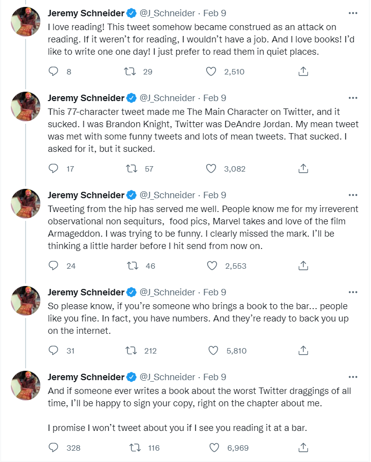

# Repair and Reintegration
- [Enforcing Social Norms: The Morality of Public Shaming](https://philpapers.org/archive/BILESN.pdf)
  - “Public shaming must aim at, and make possible, the reintegration of the norm violator back into the community, rather than permanently stigmatizing them.”
- [Famous abusers seek easy forgiveness. Rosh Hashanah teaches us repentance is hard. By Danya Ruttenberg](https://www.washingtonpost.com/outlook/famous-abusers-seek-easy-forgiveness-rosh-hashanah-teaches-us-repentance-is-hard/2018/09/06/c2dc2cac-b0ab-11e8-9a6a-565d92a3585d_story.html)
  - What is needed for repentance and repair?
    1. “The bad actor must **own the harm** perpetrated, ideally publicly”
    1. “They must do the hard internal work to **become the kind of person who does not harm in this way** — which is a massive undertaking, demanding tremendous introspection and confrontation of unpleasant aspects of the self”
    1. “They must **make restitution for harm done**, in whatever way that might be possible”
    1. “Then — and only then — they must **apologize sincerely to the victim**”
    1. “Lastly, **the next time** they are confronted with the opportunity to commit a similar misdeed, they must **make a different, better choice**”

## Repair Example

- A tweet making fun of people who read books at bars
Widely commented on and condemned on twitter (the “main character of the day”)
  - 
- In an unusual outcome to these types of events: three days later, the person gave an apology that was mostly accepted by twitter users as a good apology
  - 
  - 
  - TODO: Mark the steps of repentance and repair (done in slide)

## Discussion questions?
- Pick a situation where someone is being publicly shamed. Who is responsible for accepting or rejecting their apology/repentance?
- Pick a social media platform and a situation where someone is being publicly shamed. What might that person do to try to repair or reintegrate after the public shaming?
- Pick a social media platform. In what ways does that platform make it difficult to repair or reintegrate after public shaming?
