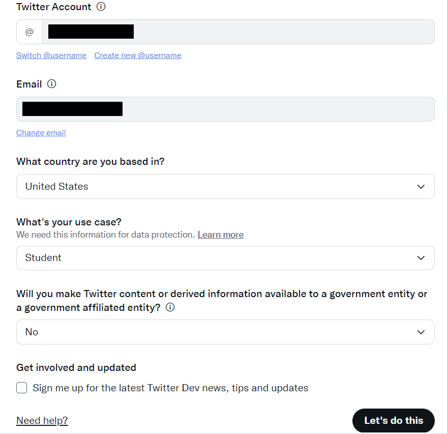

# Making a Twitter Bot Account

## Sign up for Twitter
https://twitter.com/signup

Note: If you want to make a new account and you already have one, you may need to sign out from your current account, or use a different web browser (e.g., Mozilla, Google Chrome, Microsoft Edge, Safari).

## Sign up for "developer access" (bot permisson)
Essential access application:
https://developer.twitter.com/en/portal/petition/essential/basic-info

Probably list yourself as a student,

## Get special "bot" passwords
Once you have developer access, you'll need a set of 5 special passwords to be able to make a fully functional Twitter bot:
- Bearer Token
- Consumer Key (aka "API Key")
- Consumer Secret (aka "API Key Secret")
- Access Token
- Access Token Secret

You'll want to enable all of these and then save them somewhere so that you can find them again (e.g., send yourself an email).

In order to get them all, do the following:

Go to the twitter developer portal (https://developer.twitter.com/en/portal)

In Projects & Apps, press “Add App” (note in my screenshot I already have an app added).

For the App Environment, select production

Then choose whatever name you want for this “project,” for example “info198botNETID” (with your uw name or something where I wrote NETID)

Now save these keys, both somewhere on your computer as a backup and copy them into the single quotes in the my_bot_keys.py in your JupyterHub files
“API Key” goes into the “consumer_key” variable
“API Key Secret” goes into the “consumer_secret” variable
“Bearer Token” goes into the “bearer_token” variable

Then go to the app settings for your project:

Under User Authentication Settings, click “Set-Up”

Enable both OAuth 2.0 and OAuth 1.0a and set your app type to “automated App or bot”:
Note: (I am guessing you don’t need OAuth 2, but we’ll turn it on just in case)

Then Set OAuth 1 settings to allow read and write and direct message, and if it requires “Callback URI / Redirect URL” and “Website URL”, those can be anything, and just put “http://uw.edu”

Save your settings. You will be given a Oath2.0 Client ID and Client Secret. I don’t think you need these, but save them somewhere on your computer just in case

Now, in your app settings, press “Keys and tokens”

And press “Generate” for “Access Token and Secret”

Now save these keys, both somewhere on your computer as a backup and copy them into the single quotes in the my_bot_keys.py in your JupyterHub files
“Access Token” goes into the “access_token” variable
“Access Token Secret” goes into the “access_token_secret” variable

Make sure your my_bot_keys.py is saved (if your file is saved, the tab for your file should have an x instead of gray dot)

##  Test your keys
In your JupyterHub, open the notebook called “test_twitter_bot_keys.ipynb” and try running the code. If you got the keys correctly from twitter and saved them correctly in your my_bot_keys.py, the code in that file should all work.
