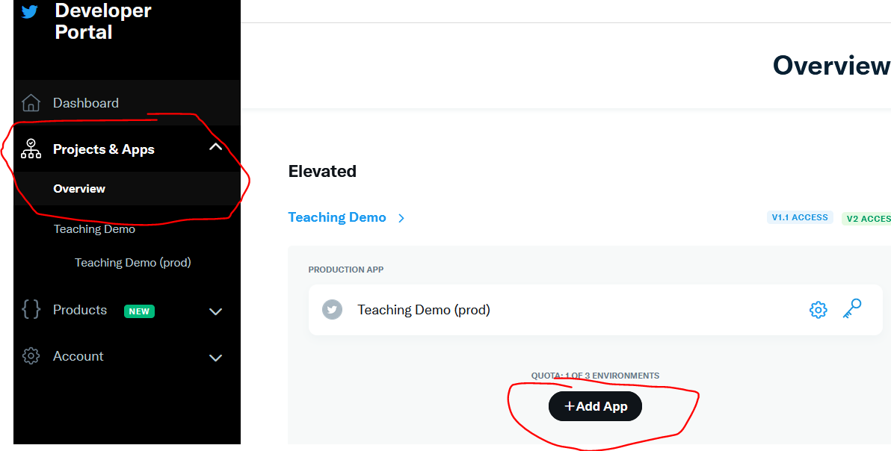
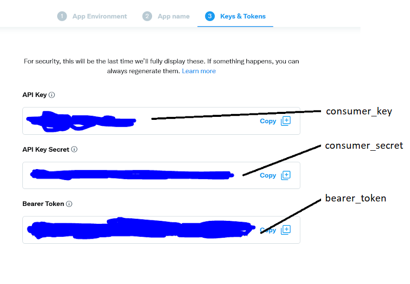
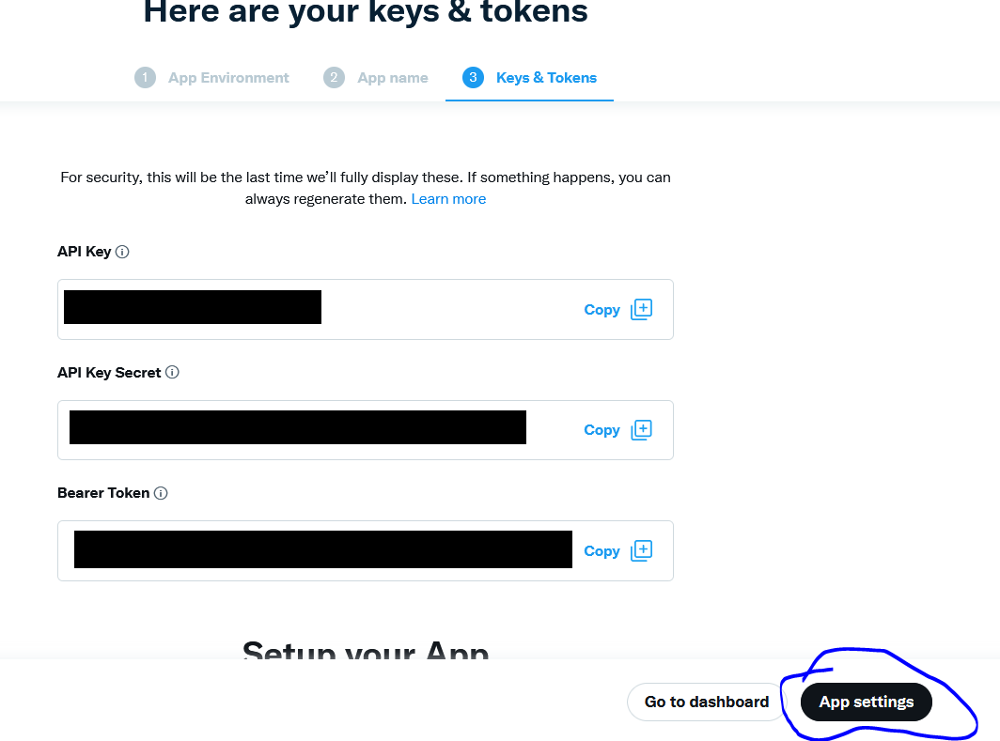
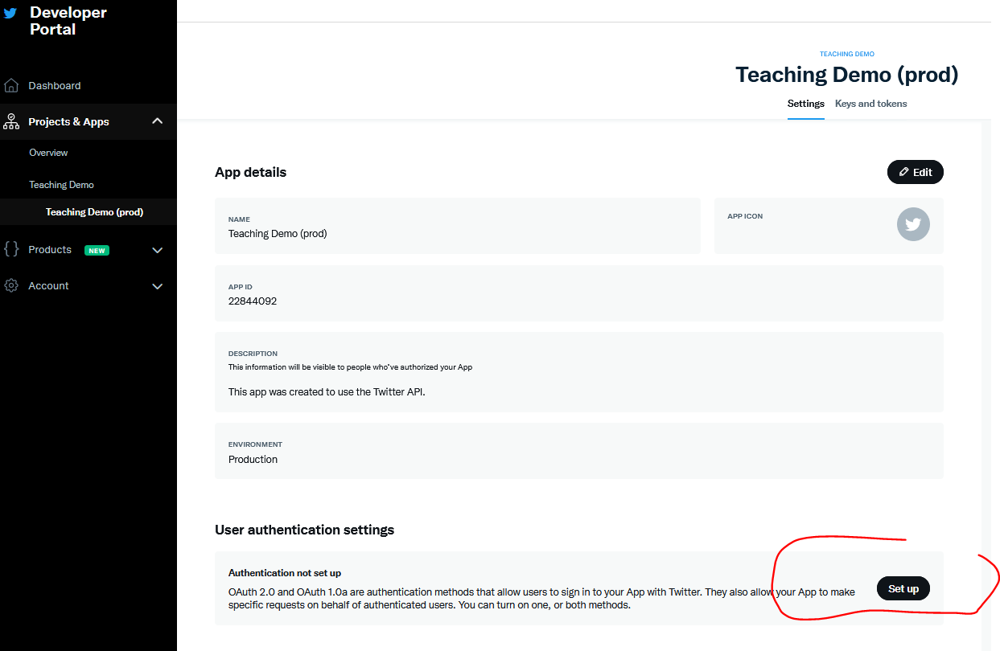
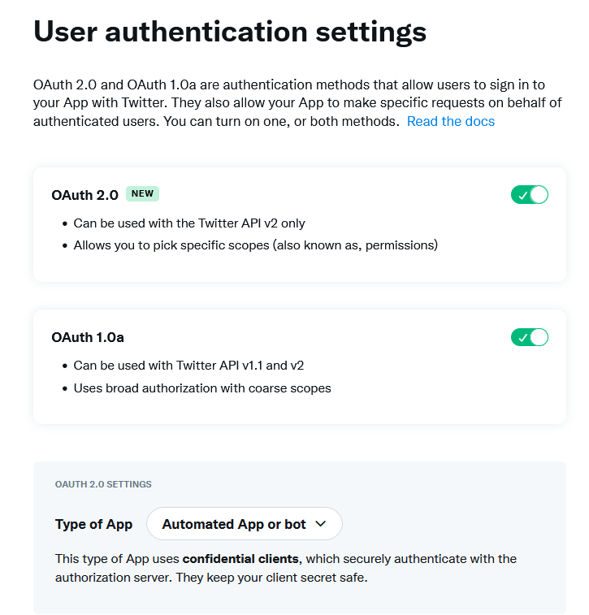
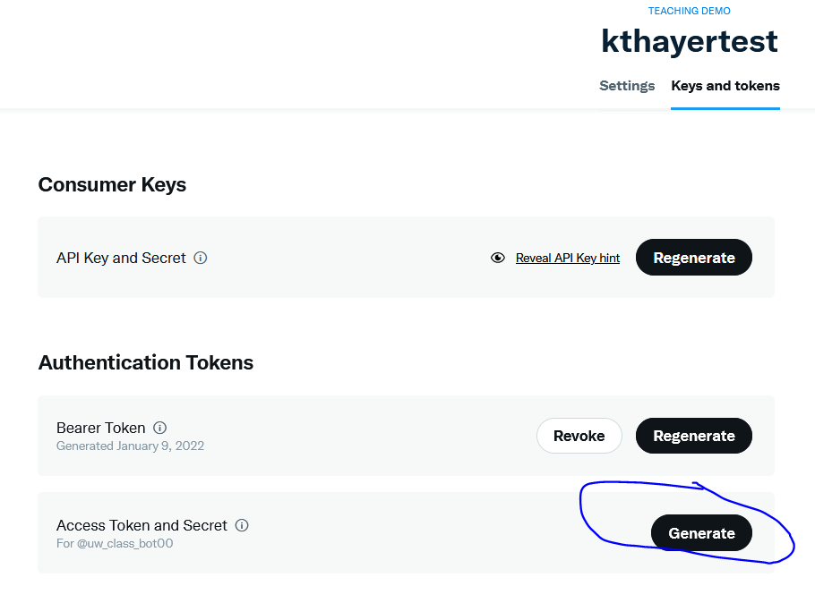

# Making a Twitter Bot Account

In using this textbook, you will have opportunities to create and run twitter bots on your own twitter account.

While we have made a fake version of Twitter for you to test all the code in this book, we highly encourage you to make a twitter bot account and try it out for real!

## Sign up for Twitter
[https://twitter.com/signup](https://twitter.com/signup)

Note: If you want to make a new account and you already have one, you may need to sign out from your current account, or use a different web browser (e.g., Mozilla, Google Chrome, Microsoft Edge, Safari).

## Sign up for "developer access" (bot permisson)
Now that you have a twitter account, you need to get permission to use it as a bot. This is called "developer access." The fastest way of doing this is to sign up for
"Essential access," so go here to sign up for essential accesss:
[https://developer.twitter.com/en/portal/petition/essential/basic-info](https://developer.twitter.com/en/portal/petition/essential/basic-info)

Note when filling this out, that the information button on the question about sharing data with a government says that a government funded university doesn't count.

## Get special "bot" passwords
Once you have developer access, you'll need a set of 5 special passwords to be able to make a fully functional Twitter bot:
- Bearer Token
- Consumer Key (aka "API Key")
- Consumer Secret (aka "API Key Secret")
- Access Token
- Access Token Secret

You'll want to get all of these and then save them somewhere so that you can find them again (e.g., send yourself an email).

In order to get these 5 special passwords, do the following:

Go to the twitter developer portal (https://developer.twitter.com/en/portal)

In Projects & Apps, press “Add App” (note in my screenshot I already have an app added).

For the App Environment, select production

Then choose whatever name you want for this “project,” for example “testbotkylethayer”

Now save these keys somewhere on your computer. Later, when you write Twitter bots:
- “API Key” will be called “consumer_key”
- “API Key Secret” will be called “consumer_secret”
- “Bearer Token” will be called “bearer_token”

Then go to the app settings for your project:

Under User Authentication Settings, click “Set-Up”

Enable both OAuth 2.0 and OAuth 1.0a and set your app type to “automated App or bot”:
Note: (I am guessing you don’t need OAuth 2, but we’ll turn it on just in case)

Then Set OAuth 1 settings to allow read and write and direct message, and if it requires “Callback URI / Redirect URL” and “Website URL”, those can be anything, and just put “http://uw.edu”

Save your settings. You will be given a Oath2.0 Client ID and Client Secret. I don’t think you need these, but save them somewhere on your computer just in case

Now, in your app settings, press “Keys and tokens”

And press “Generate” for “Access Token and Secret”

Now save these keys, both somewhere on your computer. Later, when you write Twitter bots:
- “Access Token” will be called “access_token”
- “Access Token Secret” will be called “access_token_secret”

##  Test your keys
When you get to chapter 2.3.8 (Demo: Try Running the Twitter Bot!), you can try running the code and replacing the fake special passwords with the ones from your account, and see if you can use the code to post a tweet.
